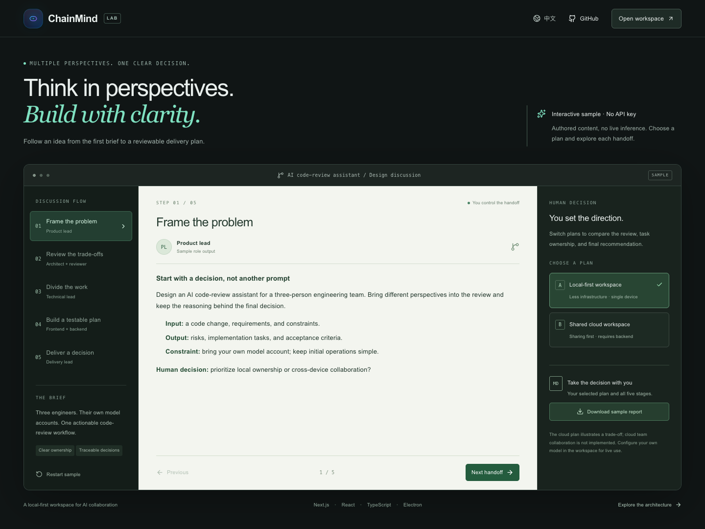
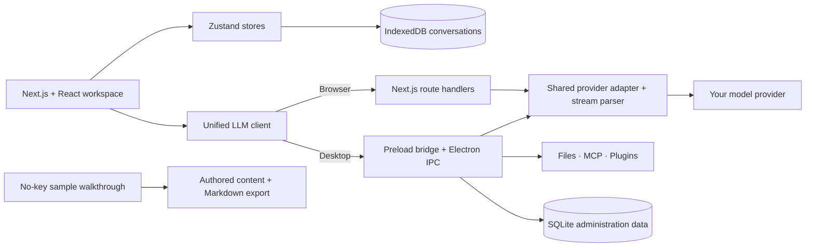

<p align="center">
  
</p>

<p align="center">
  <strong>A local-first AI workspace that turns different perspectives into a reviewable plan.</strong>
</p>

<p align="center">
  <a href="https://github.com/djblack1209-coder/ChainMind/actions/workflows/ci.yml"></a>
  
  
  
  
</p>

<p align="center">
  English · <a href="README.zh-CN.md">简体中文</a><br />
  <a href="#try-it">Try it</a> · <a href="#architecture">Architecture</a> · <a href="docs/technical-tour.md">Technical tour</a> · <a href="docs/roadmap.md">Roadmap</a>
</p>

## Why ChainMind?

A useful AI discussion needs more than another answer: it needs a clear brief,
different viewpoints, a human decision, and a result someone can act on.

ChainMind brings **streaming chat, role-based discussions, and model comparison**
into one desktop-oriented workspace. Configure your own provider, inspect each
handoff, and keep conversations on your device.

- **Discuss in stages.** Move from intake through review, task assignment, execution, and a final report.
- **Keep a person in the loop.** Choose a proposal, provide feedback, and inspect role-specific output.
- **Bring your own models.** Configure Claude, OpenAI, or Gemini endpoints, including supported compatible gateways.
- **Keep context close.** Persist conversations locally; desktop integrations add file indexing, tools, MCP, and SQLite-backed administration.

The project is **experimental**. Desktop integrations have different maturity levels;
see the [capability boundaries](#what-works-and-what-is-still-experimental).
The main workspace is Chinese-first; the sample walkthrough is available in English and Chinese.

## See the workflow



*Actual `/demo` page. Content is authored teaching material, not a live AI run or a quality benchmark.*

**Example:** a three-person team needs an AI code-review assistant. Choose between
a local-first design and a shared-cloud design, compare the review and ownership
changes, then export the complete discussion as Markdown.

```text
Brief → Review trade-offs → Assign roles → Define acceptance checks → Deliver
                ↑
         You choose the plan
```

## Try it

**Requirements:** Node.js 22.12+ (22.x), npm, and Git. `better-sqlite3` may require a native
compiler toolchain; see [setup notes](docs/getting-started.md#native-module-troubleshooting).
No environment file or API key is needed for the sample.

```bash
git clone https://github.com/djblack1209-coder/ChainMind.git
cd ChainMind
npm ci
npm run dev
```

Open **[http://127.0.0.1:3000/demo](http://127.0.0.1:3000/demo)**.
Choose a plan, step through the discussion, switch languages, and download a report.
The sample does not call providers or write to your chat history.

For live use, open **[http://127.0.0.1:3000/workspace](http://127.0.0.1:3000/workspace)**,
configure your own API key and base URL, select an available model, and start a
conversation or chain discussion. Provider use may incur charges. No provider credentials are bundled; model availability depends on your provider.

To launch the desktop development app:

```bash
npm run electron:dev
```

Electron starts its own Next.js server on `127.0.0.1:3456`.
There is **no verified signed release to download yet**.
See [setup, storage and troubleshooting](docs/getting-started.md).

## Architecture



| Engineering question | Where to look |
| :--- | :--- |
| How does a stream work in browser and Electron? | [`lib/llm-client.ts`](lib/llm-client.ts), [`lib/llm-core.js`](lib/llm-core.js), [`electron/llm-proxy.js`](electron/llm-proxy.js) |
| How are discussions modeled and restored? | [`lib/types.ts`](lib/types.ts), [`stores/chain-store.ts`](stores/chain-store.ts), [`lib/chain-workflow.ts`](lib/chain-workflow.ts) |
| How does the UI handle guided collaboration? | [`components/ChainPanel.tsx`](components/ChainPanel.tsx), [`lib/execution-engine.ts`](lib/execution-engine.ts) |
| How are native capabilities exposed? | [`electron/preload.js`](electron/preload.js), [`electron/ipc-core-handlers.js`](electron/ipc-core-handlers.js) |
| How are failures exercised? | [`tests/llm-client.test.ts`](tests/llm-client.test.ts), [`tests/chain-store.test.ts`](tests/chain-store.test.ts), [`tests/api-routes-security.test.ts`](tests/api-routes-security.test.ts) |

For a walkthrough of the trade-offs and a five-minute demo script, see the
[technical tour](docs/technical-tour.md).

## What works and what is still experimental

| Surface | Current scope |
| :--- | :--- |
| No-key sample | Interactive, bilingual, two decision paths, Markdown export; authored content |
| Chat and comparison | Streaming, local sessions, provider settings, export; real calls need your credentials |
| Guided discussions | Stage and role UI, plan selection, task assignment, retry/stop paths; model quality is not benchmarked |
| Desktop integrations | File indexing, native tools, SQLite, MCP stdio and plugin modules; not all UI paths are complete |
| DAG editor | Engine and node components exist; a complete editor is not mounted in the workspace |
| Cloud collaboration | Not implemented; the sample cloud plan is an architectural example |
| Distribution | Packaging configuration exists; icons, cross-platform Electron verification, signing and update delivery need release work |

Local persistence does **not** mean cloud inference stays on the device. The browser
key-storage fallback is not a hardened vault. Keep the server on loopback; this is
not a public multi-tenant backend. Details: [SECURITY.md](SECURITY.md).

## Development

```bash
npm run check:secrets
npm run lint
npm run typecheck
npm run test:ci
npm run build
```

`npm test` and `test:ci` run the same suite. SQLite uses `better-sqlite3` 13's
Node-API binaries, so testing does not automatically rebuild it for a different
runtime. See [CONTRIBUTING.md](CONTRIBUTING.md).

## Roadmap & contributions

The next priorities are a reliable real-provider discussion loop, a smaller guided
workflow controller, a real MCP configuration surface, and reproducible desktop releases.
Acceptance criteria are in the [roadmap](docs/roadmap.md).

Found an onboarding problem or have a useful discussion example?
[Open an issue](https://github.com/djblack1209-coder/ChainMind/issues/new/choose).
If this direction is useful to you, a **Star** helps others discover the project.

## License & acknowledgements

A root license has not yet been selected. Do not assume MIT or other permissive
reuse terms. Licensing and upstream attribution review are tracked as release work.

Built on React, Next.js, Electron, Zustand, React Flow, and the libraries listed in
[`package.json`](package.json). Desktop administration modules contain GVA-inspired
design notes; see [attribution status](docs/attribution.md) before redistribution.
