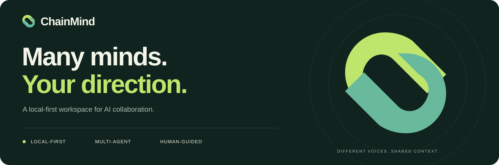
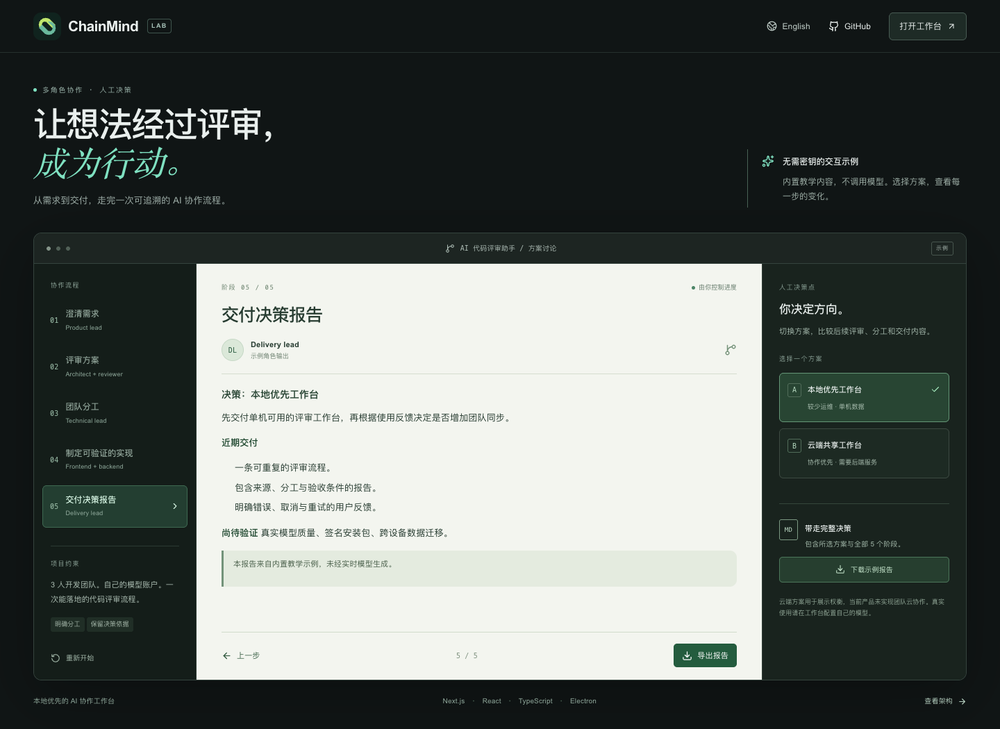

<p align="center"></p>

<p align="center"><strong>本地优先的 AI 协作工作台：需求澄清、角色评审、人工决策与交付报告。</strong></p>

<p align="center">
  <a href="https://github.com/djblack1209-coder/ChainMind/actions/workflows/ci.yml"></a>
  
  
  
  
</p>

<p align="center"><a href="README.md">English</a> · 简体中文<br /><a href="#快速开始">快速开始</a> · <a href="README.md#architecture">架构图</a> · <a href="docs/technical-tour.md">技术讲解</a> · <a href="docs/roadmap.md">路线图</a></p>

## 为什么做 ChainMind

复杂问题需要不同角色提出意见，也需要人来决定方向，并把讨论转成可执行的结果。

ChainMind 将**流式对话、链式多角色讨论、多模型对比**整合进一个面向桌面的工作台。你配置自己的模型，查看每一步交接，并在本地保留会话。

- **按阶段推进**：需求接待、方案评审、团队分工、执行和报告。
- **保留人工决策**：选择方案、补充约束、检查各角色输出。
- **自带模型账户**：配置 Claude、OpenAI、Gemini 及支持的兼容网关。
- **贴近本地工作**：会话本地持久化；桌面端提供文件索引、工具、MCP 和 SQLite 管理模块。

当前处于**实验阶段**。主工作台以中文为主；交互示例支持中英切换。桌面集成、分发和真实模型质量的边界见下文。

## 先看一次协作



*截图来自 `/demo` 实际页面。内容为内置教学示例，没有调用真实模型，也不代表推理质量或性能测试。*

示例场景：为 3 人团队设计 AI 代码评审助手。比较「本地优先」和「云端共享」两种方向，查看方案选择如何影响评审、分工和交付，最后导出完整 Markdown。

```text
澄清需求 → 评审方案 → 分配角色 → 制定验收标准 → 交付报告
              ↑
          由你选择方向
```

## 快速开始

需要 **Node.js 22.12+（22.x）、npm 和 Git**。SQLite 原生依赖可能需要编译工具，见[安装说明](docs/getting-started.md#native-module-troubleshooting)。示例无需 `.env` 或 API Key。

```bash
git clone https://github.com/djblack1209-coder/ChainMind.git
cd ChainMind
npm ci
npm run dev
```

打开 **[http://127.0.0.1:3000/demo](http://127.0.0.1:3000/demo)**，即可切换语言、选择方案、逐步查看和导出报告。示例不向供应商发请求，也不写入你的聊天历史。

真实使用：打开 **[http://127.0.0.1:3000/workspace](http://127.0.0.1:3000/workspace)**，配置自己的 API Key 与 Base URL，选择账户可用的模型，再创建对话或 Chain 讨论。供应商调用可能产生费用，仓库不提供共享密钥。

桌面开发模式：

```bash
npm run electron:dev
```

Electron 会自行启动 `127.0.0.1:3456` 的 Next.js 服务。当前**没有经过验证的签名安装包**；不要将已有打包配置理解为已经发布。

## 技术结构

完整架构图见 [Architecture](README.md#architecture)。

| 层次 | 关键实现 | 可以讨论的工程问题 |
| :--- | :--- | :--- |
| 交互与状态 | React、Zustand、IndexedDB | 流式更新与持久化频率、恢复语义 |
| 模型通信 | `llm-client`、`llm-core`、API Routes | 浏览器/Electron 双路径、SSE 分片、取消传播 |
| 链式协作 | `chain-store`、`chain-workflow`、`ChainPanel` | 阶段、角色、人工选择、失败恢复 |
| 桌面桥接 | preload、IPC、SQLite | 原生权限边界、渲染进程隔离、ABI |
| 工具扩展 | 文件索引、MCP、插件模块 | 超时、断连清理、权限与沙箱边界 |

[技术讲解文档](docs/technical-tour.md)提供 5 分钟演示顺序、源码入口、取舍与常见面试追问。

## 能力边界

| 功能 | 当前范围 |
| :--- | :--- |
| 无密钥示例 | 中英双语、两种决策路径、Markdown 导出；内容为教学样例 |
| 对话与对比 | 流式输出、会话管理、模型设置、导出；真实调用需自己的凭据 |
| 引导式讨论 | 阶段、角色、方案选择、任务分工、停止和重试路径；质量尚未基准评测 |
| 桌面扩展 | 文件、工具、SQLite、MCP stdio、插件底层模块；部分 UI 未完整接通 |
| DAG 编辑器 | 引擎和节点组件存在，完整编辑器尚未挂载到工作台 |
| 团队云协作 | 未实现；演示中的云端方案用于说明架构权衡 |
| 安装与更新 | 图标和配置已补齐；仍需 Electron 跨平台安装、签名和更新验收 |

会话保存在本地，不代表调用云模型时数据不会离开设备。浏览器密钥存储的回退机制也不是专业密钥保险库。开发服务应保持在 loopback；详见 [SECURITY.md](SECURITY.md)。

## 开发与参与

```bash
npm run check:secrets
npm run lint
npm run typecheck
npm run test:ci
npm run build
```

`npm test` 与 `test:ci` 运行同一测试集。当前采用 `better-sqlite3` 13 的 Node-API 预编译模块，测试不再自动切换 Node/Electron ABI。详见 [CONTRIBUTING.md](CONTRIBUTING.md)。

下一步优先补真实模型闭环、拆分协作控制器、接通 MCP UI 和桌面分发，验收标准写在[路线图](docs/roadmap.md)中。

欢迎提交可复现的问题和有价值的讨论示例。如果这个方向对你有用，可以点一个 **Star**，让更多人看到它。

## 许可与致谢

当前尚未选定根许可证，不能默认按 MIT 等宽松许可复用。发布前还需完成上游归属检查。

感谢 React、Next.js、Electron、Zustand、React Flow 及 `package.json` 所列依赖。部分管理模块有 GVA 设计借鉴或移植注释，详见[归属状态](docs/attribution.md)。

品牌图形、桌面图标及生成方法见[品牌设计说明](docs/brand.md)。
