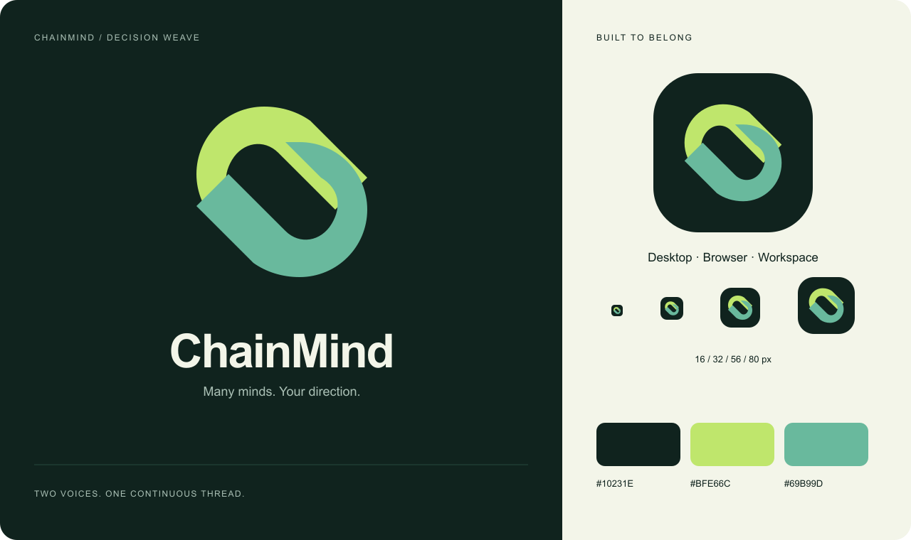

# ChainMind identity



**Decision Weave** uses two folded ribbons to suggest linked conversations. Each
voice keeps its own color while sharing one continuous opening. The two forms
also echo an open **C**. The accompanying line is **Many minds. Your direction.**

The mark uses flat, filled geometry so it remains recognizable at favicon sizes.
There are no embedded fonts, external image URLs, filters, or animation in the
symbol. Its source is [`lib/brand.json`](../lib/brand.json), shared by the React
component and asset generator.

## Assets

| Use | File |
| :--- | :--- |
| Standalone symbol, transparent background | [`public/brand-symbol.svg`](../public/brand-symbol.svg) |
| App tile / favicon | [`public/icon.svg`](../public/icon.svg), [`public/favicon.svg`](../public/favicon.svg) |
| Mobile home screen | `public/apple-touch-icon.png` (180), `public/icon-192.png`, `public/icon.png` (512) |
| Desktop package | `resources/icon.icns`, `resources/icon.ico`, `resources/icon.png` (1024) |
| GitHub README | [`hero.svg`](assets/hero.svg) |
| GitHub social preview, 1280 × 640 | [`social-preview.png`](assets/social-preview.png) |

This social image was uploaded to this repository on 2026-09-13. GitHub confirmed
that a custom Open Graph image is active. For future changes, upload the new file
under **Settings → General → Social preview**; a Git commit alone does not update it.

## Regenerate

```bash
npm ci
npm run brand:generate
```

The generator uses `sharp` and writes PNG-compressed ICO/ICNS files without an
OS-specific converter. It also renders the cover and this identity board. Cover
text uses system sans-serif fonts; rasterized typography may vary between hosts.
Review generated images before committing. PNG, ICO and ICNS are exports, not
separate source artwork.

Keep the ribbon proportions and leave clear space around the symbol. Use the
ink tile when placing it on bright or busy backgrounds. Palette: ink `#10231E`,
paper `#F3F5E9`, lime `#BFE66C`, jade `#69B99D`.

These assets were drawn directly as vector geometry for this project; no stock
logo or external image was embedded. This does not resolve the repository's
outstanding [licensing and attribution](attribution.md) work.
