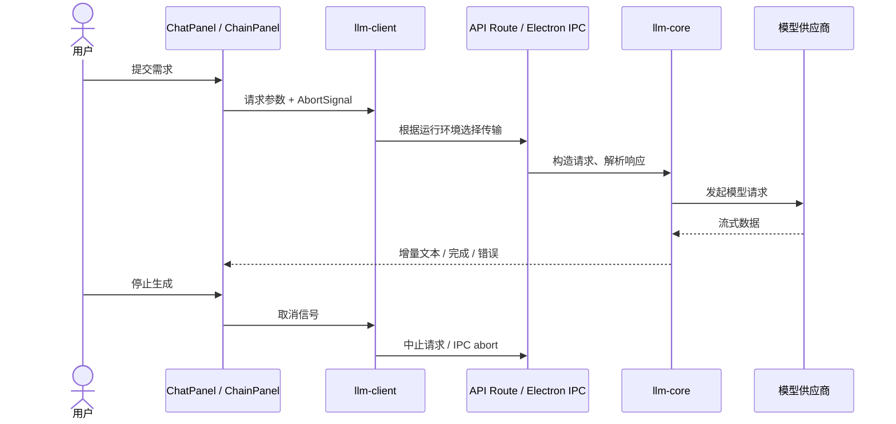

# ChainMind 技术讲解：从演示到源码

适用方向：全栈 / AI 应用开发。本文是源码导览与演示脚本，不替代真实模型验收，也不替代对本人贡献范围的说明。

## 30 秒介绍

> ChainMind 是一个本地优先的 AI 协作工作台。我希望解决的是：复杂需求经过多个角色讨论后，如何保留人工选择、责任分工和交付依据。项目用 Next.js、React、Zustand 构建交互与状态，通过共享模型适配层同时支持浏览器 HTTP 和 Electron IPC。现阶段重点是把这条用户路径做成可观察、可停止、可恢复的流程。

请按自己实际负责的部分调整“我设计/实现”的措辞。不要把所有依赖库、借鉴模块或本次生成的内容都说成原创。

## 5 分钟演示

| 时间 | 展示 | 要讲清的内容 |
| :--- | :--- | :--- |
| 0:00–0:40 | `/demo`，切到中文 | 明确这是内置教学样例，不是实时模型输出 |
| 0:40–1:30 | 切换 A/B 方案 | 人的选择影响评审、分工和最终建议；两种路径都能解释 |
| 1:30–2:10 | 团队分工与验收阶段 | 讨论应产出责任和验收条件，而不只是更多文本 |
| 2:10–2:40 | 导出 Markdown | 带走完整上下文与所选方案；当前不是持久化任务队列 |
| 2:40–3:40 | `llm-client` 与相关测试 | 浏览器与 Electron 共用调用语义，重点看取消和流式数据 |
| 3:40–4:30 | `chain-store` 与测试 | 流式高频更新、去抖保存、恢复数据默认值 |
| 4:30–5:00 | 路线图与限制 | 说明尚未完成的真实模型回归、DAG 入口、MCP UI 和发行工作 |

如果要展示真实 AI，请预先配置自己的可用模型并完成一次彩排。网络或供应商不可用时，可以完整展示教学样例，但必须保持“非实时”的说明。

## 一次请求怎么走

入口：[ChatPanel](../components/ChatPanel.tsx)、[ChainPanel](../components/ChainPanel.tsx)、
[llm-client](../lib/llm-client.ts)、[llm-core](../lib/llm-core.js)、[llm-proxy](../electron/llm-proxy.js)。
链式讨论组件中仍存在较多编排逻辑；不要宣称所有流程已经收敛到一个独立状态机。

## 值得讲的工程取舍

| 问题 | 当前选择 | 代价与可验证依据 |
| :--- | :--- | :--- |
| 为什么浏览器和 Electron 双路径？ | `llm-client` 封装 HTTP/IPC | 增加两条传输路径的回归负担；[测试](../tests/llm-client.test.ts)覆盖两条路径和 IPC 取消 |
| 为什么会话不用 SQLite 统一存储？ | 会话 IndexedDB，桌面管理 SQLite | 浏览器可独立运行，但两套存储和备份要分别考虑；[storage](../lib/storage.ts)、[database](../electron/database.js) |
| 如何应对流式持久化高频写？ | 状态先更新，500 ms 去抖保存，maxWait 2 s | 页面退出前的持久化窗口仍需专项验证；[chain-store](../stores/chain-store.ts)、[持久化测试](../tests/chain-store.test.ts) |
| 如何限制原生权限？ | preload 白名单 API、contextIsolation、关闭 nodeIntegration | 桥接隔离不能证明插件或命令是 OS 级沙箱；[window-manager](../electron/window-manager.js)、[preload](../electron/preload.js) |
| 为什么先做可重复示例？ | 不依赖供应商、无密钥、两条明确路径 | 教学材料不证明智能体效果；[demo-discussion](../lib/demo-discussion.ts)、[示例测试](../tests/demo-discussion.test.ts) |

SQLite 的一次具体改进：旧版依赖在 Node/Electron 间需要重复编译，升级 Electron 后还会遇到 V8 API 不兼容。本轮采用 `better-sqlite3` 13 的 Node-API 实现，并去掉自动切换 ABI 的测试/启动钩子。是否跨平台可用仍需分别验证；上游说明见 [13.0.0 release](https://github.com/WiseLibs/better-sqlite3/releases/tag/v13.0.0)。

## 面试追问与诚实的回答边界

**多智能体一定比单模型好吗？** 目前没有受控实验支持这个结论。需要同一批任务、同预算的单模型基线，以及盲评正确性、遗漏、成本和耗时。角色数量本身不是效果指标。

**暂停、重试和进程重启是一回事吗？** 不是。当前有用户停止、阶段状态和重试代码，但不能据此宣称具备持久化工作流引擎的 exactly-once 或 crash recovery 语义。

**MCP 是否完整可用？** 后端有 stdio 客户端和断连清理测试；当前配置面板与后端协议仍需统一，不能只看后端测试就称 UI 闭环完成。

**本地优先是否意味着数据不出设备？** 会话本地持久化；云模型仍接收发送的上下文。浏览器密钥回退机制的保护能力有限，生产凭据使用需要更强设计。

**相比 Dify / Flowise / AutoGen，为什么继续自建？** 自建的价值是探索“桌面上的人机协作与可追踪交付”这个窄场景，同时锻炼完整工程能力。如果目标是成熟的团队级 AI 平台，应认真评估现有工具：

- [Dify](https://github.com/langgenius/dify)整合工作流、RAG、模型管理和运维能力。
- [Flowise](https://docs.flowiseai.com/)面向可视化 Agent / LLM 工作流构建。
- [AutoGen](https://github.com/microsoft/autogen)提供程序化多智能体应用框架；采用前阅读其当前维护说明。

这里的定位判断是基于本项目源码与这些项目官方说明的分析，并非功能或性能对标。不要宣称 ChainMind 全面优于它们。

## 简历描述参考

按本人实际贡献范围取用，不添加未经测量的用户数、并发数或性能百分比：

- 基于 Next.js、React、TypeScript 与 Electron 构建本地 AI 协作工作台，整合多模型流式对话、分阶段讨论和模型对比。
- 维护 HTTP/IPC 双传输模型调用与取消机制，使用 Vitest 覆盖流式处理、会话持久化和接口边界。
- 完善无密钥双语演示、Markdown 交付、GitHub 文档与 CI，使项目能够被独立安装、审阅和演示。

## 分享前检查

优先分享仓库首页和一个明确的演示路径。实际验收记录见[当前状态](project-status.md)。安装包、真实 API、受支持的 Electron 与许可问题没有完成前，不使用“企业级”“生产就绪”“完全安全”“自研全部模块”等表述。
